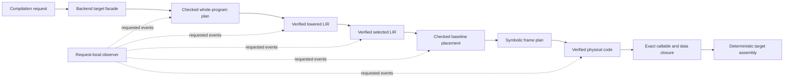

# Low-Level Compiler Consolidation and Adoption Design Proposal

Status: accepted, frozen, promoted, and archived, 2026-09-20. Accepted from the
proposal committed as `b7c838fa`. This is the focused LA05 design under the
accepted
[low-level compiler architecture](../roadmaps/LOW_LEVEL_COMPILER_ARCHITECTURE_DESIGN_PROPOSAL.md).
Source assessment: `0c56a9f9`, after complete private lowering parity and the
placement-checking scalability correction. Implementation is planned by the
[consolidation and adoption roadmap](../roadmaps/LOW_LEVEL_COMPILER_ADOPTION_ROADMAP.md).

Inherited contracts are frozen by the archived
[phase architecture](LOW_LEVEL_PHASE_ARCHITECTURE_DESIGN_PROPOSAL.md),
[LIR model](LOW_LEVEL_IR_MODEL_DESIGN_PROPOSAL.md),
[target selection and physical realization](TARGET_SELECTION_PHYSICAL_REALIZATION_DESIGN_PROPOSAL.md),
and [complete lowering migration](COMPLETE_LOW_LEVEL_LOWERING_MIGRATION_DESIGN_PROPOSAL.md)
designs. The maintained
[migration coverage record](../roadmaps/LOW_LEVEL_COMPILER_MIGRATION_COVERAGE.md) is the
authoritative handoff for operation coverage, retained transition artifacts,
observations, and unresolved cost evidence.

## Purpose and completion boundary

Adopt the checked low-level pipeline as the only production native compiler,
then remove the direct MIR-to-assembly backend and the scaffolding that kept the
new pipeline private. This work turns an independently complete architectural
implementation into the ordinary compiler path. It also makes its phases
observable through the existing request-local reporting and inspection
facilities, updates living contracts, and closes the cumulative foundation
review before register allocation begins.

LA05 is complete only when:

- the public backend entry always compiles supported x86-64 programs through
  checked planning, LIR lowering, target selection, checked baseline placement,
  symbolic frame planning, physical realization, physical verification,
  artifact closure, and deterministic emission;
- there is no production option, implicit retry, feature allowlist, or
  per-program fallback to direct lowering;
- phase observations are request-local, requested-only, deterministic where
  their payload is deterministic, and unable to influence compilation;
- backend failures preserve their owning phase and useful target/callable
  context through the existing compiler error boundary;
- the legacy selector, machine model, frame path, emitter, and migration-only
  adapters have been deleted or given one documented continuing owner;
- native behavior, artifact policies, ABI behavior, trace behavior, reporting,
  deterministic output, and supported configurations pass their final gates;
- compatible measurements resolve the eleven previously inconclusive timing
  classifications and give the foundation an explicit cost disposition;
- shared low-level modules pass a portability review against the established
  synthetic-target contracts; and
- the complete LA01-LA05 diff is reviewed as one architecture change, living
  documentation describes only the adopted path, and the migration coverage
  record is reconciled and archived.

The production placement policy remains the independently checked baseline
stack strategy. Register allocation belongs to LA06 and is not needed to
justify this architecture. This proposal also excludes scalar promotion,
semantic SSA, new LIR optimizations, a complete AArch64 backend, language or ABI
changes, and unrelated standard-library work.

## Present state

The backend facade receives sealed `VerifiedFinalMirProgram` input and dispatches
by target. The production x86-64 entry still uses the direct backend, whose
legality, runtime-trace, frame, lowering, artifact-retention, and emission
modules form one old path. The complete checked path lives below the private
`native::pilot` entry and has no fallback after planning begins.

The private path already covers the full supported language surface under both
MIR schedules, both runtime-trace policies, and both artifact-retention modes.
It owns checked planning, discovery lowering, immutable target declarations,
executable lowering, selection, selected-program closure, baseline placement,
frame planning, realization, physical verification, exact program closure, and
assembly publication. Its private checkpoint adapter can stream lowered,
selected, placement, frame, and physical views on request. Its error wrapper
preserves phase-specific failures internally, but its name, visibility, and
driver integration still describe an experiment.

This creates three adoption gaps rather than a language-coverage gap:

1. `backend::emit_assembly` still selects the direct implementation.
2. The public driver observes one broad backend-emission phase and cannot
   request the verified low-level checkpoints or phase-local metrics.
3. Both implementations and the lint allowances needed by the private path
   remain in the production tree.

The old and new assembly need not be textually identical. The acceptance
boundary is equivalent native behavior, ABI and runtime contracts, exact
artifact policy, stable diagnostics categories, and deterministic output within
each supported configuration.

## Accepted production architecture

### One target entry and one native pipeline

`backend::emit_assembly` remains the stable compiler facade. Target dispatch
continues there, and the x86-64 target delegates directly to the checked native
pipeline. The private pilot orchestration becomes the ordinary target pipeline
and loses experimental naming. `native::pipeline` is the expected owner unless
implementation review finds an already established facade with a clearer name.

The cutover is a single production-boundary change. Do not add a public backend
mode, environment switch, CLI flag, or persistent old/new selector. A narrow
test or measurement seam may select an implementation before the cutover so
that equivalent builds can be captured, but it must be recorded as a temporary
artifact and removed with the direct path.

The adopted path must not retry through legacy lowering after a checked-phase
failure. A failure is evidence of a compiler defect or invalid target product;
fallback would hide the defect and split verification authority. The only
supported rollback occurs at the implementation roadmap's explicit adoption
checkpoint, by leaving the public default unchanged while corrective work is
scheduled.

### Phase ownership remains unchanged

Adoption changes orchestration and visibility, not phase authority:

| Phase | Production responsibility | Forbidden dependency or action |
| --- | --- | --- |
| Checked planning | Freeze semantic, layout, ABI, trace, runtime, generated-family, data, and artifact facts from sealed final MIR | No target instructions, physical registers, frame offsets, or reporting-driven decisions |
| Shared lowering | Publish verified target-independent values, memory operations, calls, CFG, effects, and typed dependencies | No source-model lookup outside checked plan services; no physical placement |
| Target selection | Publish target recipes, logical operands, resource constraints, ABI bindings, clobbers, and target effects | No silent storage allocation, concrete frame offsets, or semantic rediscovery |
| Placement and frame | Assign legal baseline locations, check the assignment independently, and lay out symbolic frame requirements | No new operations, branches, calls, dependencies, or undeclared scratch |
| Physical realization | Resolve transfers and recipes into legal target instructions, then verify every physical invariant | No MIR queries, target-independent semantic decisions, or unverified publication |
| Program closure and emission | Reconcile exact callable/data dependencies and render the verified program deterministically | No dependency inference from assembly text and no resurrection of sparse bodies |

Production naming, facade exports, and documentation should express these
owners. Adoption does not flatten the phases into an x86-specific lowering
module or expose builder/edit authority outside its phase.

## Error integration

Replace `NativePilotError` with a production backend error owned at the native
pipeline boundary. It remains a typed internal enumeration of planning,
discovery, ABI, lowering, selection, selected-program closure, placement,
frame, realization, physical verification, program closure, and observation
failures. Variant payloads stay typed until the target facade maps them into the
existing `BackendError` boundary.

The mapping must preserve:

- the target;
- the responsible phase;
- a callable or generated-artifact identity when the underlying failure has
  one;
- the underlying invariant or source context; and
- a separate observation-failure category so an output error is not reported
  as invalid generated code.

Do not classify failures by matching display strings. Display text should lose
the word `pilot`, remain stable enough for diagnostics, and avoid exposing Rust
module layout. Source-language diagnostics remain owned by earlier compiler
phases. Backend invariant failures remain compiler errors rather than being
reinterpreted as source errors.

## Reporting and inspection

The existing driver observer, reporting detail, and inspection services remain
the public request-local mechanism. Low-level model types and mutable builders
do not become public API merely to support reporting.

### Phase events and metrics

The broad backend-emission event remains useful as the total. Nested events
should expose stable semantic stages:

- low-level planning;
- LIR lowering and publication;
- target selection and selected-program closure;
- placement and independent checking;
- frame planning;
- physical realization and verification; and
- program closure and assembly emission.

The implementation may combine adjacent internal timings only when the phases
share one indivisible operation, but event names must not claim a boundary that
was not measured. Every started event receives exactly one terminal outcome.
Failures close the owning nested event and the enclosing backend event without
fabricated later events.

Requested metrics are derived from immutable products or receipts while those
products are resident. Expected metrics include callable/data counts, lowered
and selected structural counts, placement/check totals, frame sizes, physical
instruction counts, and emitted assembly size. Timings stay out of
deterministic dumps. Quiet reporting performs no metric traversal that is not
needed by compilation.

### Checkpoint inspection

Adapt the current lowered, selected, placement, frame, and physical checkpoint
renderers to the driver inspection service. Inspection remains explicitly
requested and streams to the supplied sink; the compiler must not retain the
whole program's rendered checkpoints. Render only verified immutable products,
in stable program/callable/block order.

The public presentation should print shared program/catalog context once and
then phase-local callable content, rather than duplicating the same context for
every checkpoint. This is a presentation concern: phase-owned renderers remain
independent and no dump may read a later phase to enrich an earlier one.

An inspection sink failure is terminal. It prevents assembly publication and
is reported through the observation error boundary. Quiet compilation creates
no renderer, writes no checkpoint bytes, and produces assembly identical to an
otherwise equivalent observed request. Parallel and repeated requests share no
observer state.

## Compatibility and adoption evidence

### Behavioral parity

Before changing the production default, the new path must pass the complete
private parity matrix already recorded in the migration coverage handoff. The
roadmap should then exercise the same matrix through the public compiler entry,
covering:

- default and minimal MIR schedules;
- enabled and omitted runtime tracing;
- complete and reachable artifact policies;
- source and generated callables, static initialization and shutdown, object
  dispatch, ownership, optionals, arrays, strings, I/O, and failure paths;
- assembler and linker acceptance, executable results, C ABI probes, runtime
  ABI symbol use, and exact artifact closure; and
- independent-process determinism for assembly, requested checkpoints, and
  report metrics that are specified as deterministic.

Tests tied only to direct-backend implementation details should move to the new
owning phase or be removed. Behavioral and ABI regressions remain as public or
cross-phase witnesses. Deleting an old test is permitted only when its invariant
is represented by an equal or stronger maintained witness.

### Compatible cost evidence

The reviewed pre-migration record at `9e3cebb1` remains historical evidence but
cannot clear adoption. Its harness fingerprint predates later checking changes,
and eleven short compile timings remain inconclusive.

The adoption roadmap must capture the legacy and candidate implementations
with the same current measurement harness, corpus, toolchain, runtime, target,
MIR schedule, trace policy, artifact policy, host controls, warmups, repetition
counts, and alternating order. Use two independent full paired captures and the
maintained `compare-foundation` procedure. A temporary measurement-only
selection seam or two preserved builds from either side of the cutover is
acceptable; public compiler behavior must not gain a selection mode.

Every supported workload/configuration classification must be resolved:

- `incompatible` or `invalid` is a no-go;
- `inconclusive` requires another compatible capture or improved host control;
- `review-required` requires correction or an explicit recorded tradeoff with
  workload, repeated evidence, cause, effect, and owner; and
- `within-review-limits` clears the cost review but does not replace the
  architectural and correctness review.

The existing repeated-trigger rules remain authoritative: compiler/native
median changes above 10 percent or RSS/text changes above 15 percent require
review only when repeated in both pairs and larger than twice the applicable
MAD. Frame growth and frame-limit failures remain visible even when aggregate
timings pass.

### Go/no-go checkpoints

The implementation roadmap must contain separate, explicit checkpoints:

| Checkpoint | Go outcome | No-go outcome |
| --- | --- | --- |
| Public-adapter readiness | Typed errors, request-local observations, and complete public-entry parity are proven while legacy remains the default | Keep the default unchanged; fix the adapter or phase defect without adding fallback |
| Foundation cost acceptance | Two compatible paired captures resolve every configuration; repeated review triggers are corrected or explicitly accepted | Keep the default unchanged; retain the private checked path and evidence, remove any rejected measurement bridge, and amend the roadmap before retrying |
| Production adoption | Switch the facade once, pass focused/public/repository gates, and record the accepted candidate | Restore the facade to the still-present legacy entry in the same focused task; diagnose before any deletion |
| Legacy retirement | Public adoption is stable, all legacy obligations have a new owner, and cumulative searches find no hidden callers | Keep the legacy implementation temporarily, record the exact blocker, and do not call LA05 complete |

Legacy deletion follows a successful cutover; it is not mixed into the task
that first changes the default. This preserves a reviewable rollback boundary
without shipping a permanent fallback.

## Legacy retirement and final module shape

Inventory every direct-backend module, symbol, test, allowance, and adapter
before deletion. Classify it as superseded implementation, reusable canonical
input projection, maintained test oracle, or shared contract. Classification
depends on ownership and consumers, not the age or path of the file.

The final source tree has:

- a small backend target registry and sealed input facade;
- shared checked planning, LIR, lowering, selected-program, placement-checking,
  frame-contract, and inspection infrastructure with no x86 policy embedded;
- an x86 target facade that owns resource facts, ABI classification,
  instruction selection, baseline placement policy, physical realization,
  program closure, and rendering; and
- one production orchestration path joining those owners.

Delete duplicate legality, layout, selection, frame, machine, artifact-closure,
trace-expansion, and emission implementations once their remaining tests and
facts have moved. Canonical semantic projection code may survive only if the
checked pipeline consumes it under an accurate shared or target-owned name.

Remove `pilot` names, private eligibility gates, temporary implementation
selectors, comparison adapters, stale comments, and production
`cfg_attr(not(test), allow(dead_code))` or `allow(unused_imports)` annotations
whose only purpose was deferred consumption. A remaining allowance needs an
item-specific reason and continuing owner. Do not retain old assembly lowering
as a test oracle after differential measurement has finished; phase verifiers,
ABI probes, semantic goldens, and native executions are the durable oracles.

## Portability review

LA05 does not implement AArch64, but it must leave a credible second-target
boundary. Review shared crates and facades for these constraints:

- shared planning and LIR contain no x86 register names, instruction forms,
  System V argument locations, red-zone assumptions, concrete frame offsets,
  or assembly syntax;
- target selection owns register banks/views, overlap and preservation,
  instruction resources, ABI bindings, bounded legalization, and target data;
- placement checking reasons over declared locations, units, ties, clobbers,
  partial preservation, and link roles without hard-coded x86 sets;
- frame and physical program contracts express target requirements through
  checked target facts; and
- program closure uses typed callable/data/link dependencies rather than x86
  symbol-text inspection.

Retain and extend the synthetic-target witnesses for overlapping views,
partially preserved resources, fixed and tied operands, stack components, and
separate link roles. Walk representative scalar, branch, call, aggregate, and
lifecycle shapes through the shared interfaces during review. These witnesses
prove contract generality; they do not claim an AArch64 implementation.

If production adoption exposes an x86 requirement missing from the frozen
target interfaces, amend the owning design explicitly and add a synthetic
target witness. Do not place an x86 convenience field in a shared product and
defer its portability explanation to a future backend.

## Documentation and records

Adoption updates living documentation in the same tasks as behavior:

- [backend architecture](../compiler/BACKEND.md) and
  [phases and IR](../compiler/PHASES_AND_IR.md) describe the checked production
  path and baseline placement policy;
- [low-level IR](../compiler/LOW_LEVEL_IR.md),
  [physical realization](../compiler/PHYSICAL_REALIZATION.md), and
  [placement checking](../compiler/PLACEMENT_CHECKING.md) describe their
  production integration rather than a private pilot;
- [reporting](../compiler/REPORTING.md) and
  [debugging](../development/DEBUGGING.md) describe public phase events,
  checkpoint selection, output ordering, and failure behavior;
- [testing](../development/TESTING.md), runtime ABI, trace, and measurement
  documentation describe the final owners and accepted evidence; and
- the overarching design, cleanup audit, optimization catalog/discoveries,
  active/archive indexes, and migration coverage record agree about foundation
  completion and pending LA06 work.

The migration coverage record remains active through cumulative closure. After
all rows, artifacts, measurements, and observation handoffs are reconciled,
archive it as the historical migration record. Move actionable independent
findings into an indexed discoveries document rather than leaving them embedded
in the archive.

## Cumulative closure

The final roadmap task must review the complete foundation, not only the LA05
working tree. Use the recorded program baseline and child-roadmap commits to
inspect cumulative `--stat`, `--name-status`, and full diffs, then include
staged, unstaged, and untracked changes. Manual commits between tasks do not
discharge cleanup obligations.

The review must:

1. reconcile every transition-ledger entry and search beyond the ledger for
   duplicate implementations, bridges, gates, aliases, allowances, stale
   experimental vocabulary, and test-only production seams;
2. read phase boundaries and target ownership as one design, checking that no
   later task bypassed earlier seals, verification, sparse-body, trace, or
   artifact-closure contracts;
3. confirm public tests use final interfaces and living documentation contains
   no rollout claims;
4. run focused native/configuration/observation/determinism/ABI tests, the
   `make check` gate, applicable `make msrv-check`, and all long-running gates
   named by the roadmap from an artifact-free snapshot or clean checkout; and
5. retain the accepted measurement evidence, archive completed planning
   records, and leave a reviewable closing change for the user to commit.

LA05 completion marks the low-level architecture foundation complete. It does
not mark A22 or the overarching program fully complete while LA06 register
allocation remains pending.

## Rejected alternatives

| Alternative | Reason rejected |
| --- | --- |
| Ship a permanent legacy/new backend switch | Doubles production ownership, permits parity drift, and weakens the meaning of checked-phase failures |
| Fall back after a new-pipeline error | Hides compiler defects and makes verification and artifact authority conditional |
| Delete legacy in the same task as the first default switch | Removes the clean rollback point before public and repository evidence has exercised the adopted boundary |
| Expose LIR and physical model types through the driver | Couples reporting to internal representation and leaks edit/verification authority |
| Require exact legacy assembly text | Preserves incidental instruction, scratch, and frame choices whose ownership intentionally changed |
| Delay all observations until after adoption | Makes the production cutover harder to diagnose and prevents adapter parity from being reviewed independently |
| Implement register allocation during consolidation | Mixes foundation correctness with a separate optimization and removes the stable baseline placement control |
| Keep direct lowering as a long-term oracle | Retains the duplicate architecture LA05 exists to remove; durable semantic, ABI, verifier, and native witnesses are stronger owners |

## Roadmap requirements

The implementation roadmap should use PR-sized tasks and include, at minimum:

1. freeze the adoption contract, exact legacy inventory, implementation
   baseline, transition ledger, and compatible measurement mechanism;
2. productionize native orchestration and typed errors without changing the
   public default;
3. add request-local phase reporting, metrics, and streaming checkpoint
   inspection with quiet/failure/determinism tests;
4. prove the full public-entry parity matrix and complete the portability
   review;
5. capture and decide the compatible two-pair foundation measurements at an
   explicit go/no-go checkpoint;
6. switch the production target facade and validate the adopted default;
7. delete the direct backend and every temporary selection/comparison bridge,
   migrate retained tests, and remove residual allowances;
8. update living documentation and records; and
9. perform cumulative foundation review, full gates, cleanup, archival, and
   the LA06 handoff.

The roadmap may split these responsibilities further where the source
inventory shows a review boundary, but it must not combine the cost decision,
first production cutover, and legacy deletion into one irreversible task.

## Decisions selected by acceptance

Acceptance selects one checked production pipeline, a single cutover at the
backend target facade, no fallback, typed phase-preserving error integration,
request-local observations through existing driver services, streamed verified
checkpoints, semantic and ABI parity rather than assembly identity, compatible
paired cost evidence before adoption, deletion only after a validated cutover,
and cumulative foundation review before LA06.

No representation or ownership decision remains open that blocks a roadmap.
Exact Rust type names, report labels, checkpoint CLI spelling, and task splits
may be refined during roadmap creation so long as they preserve the contracts
above. Any change to phase authority, target neutrality, fallback policy, cost
acceptance, or deletion order requires an explicit design amendment.
