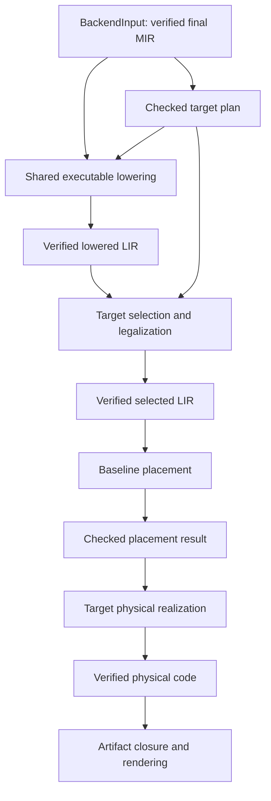

# Low-Level Phase Architecture and Backend Ownership Design Proposal

Status: accepted and frozen LA01 design, 2026-09-17. Assessed against
`d5a33858`; accepted text recorded at `97fdaf49`. The
[phase preparation roadmap](LOW_LEVEL_PHASE_ARCHITECTURE_ROADMAP.md) is complete
and archived, with qualified current-boundary witnesses and durable baseline
inputs. The active [handoff](../roadmaps/LOW_LEVEL_COMPILER_MIGRATION_COVERAGE.md#preparation-handoff-and-next-designs)
carries pending delivery; no new compiler pipeline is implemented by preparation.
Exact LIR schemas and target realization belong to LA02 and LA03 respectively.

The decisions and foundation validation policy below are the implementation
contract. Changes require an explicit amendment identifying the rationale and
affected downstream owners; roadmap execution must not silently relax them.
Illustrative Rust organization and the AArch64 ABI witness retain their stated
scope and do not freeze detailed schemas or a complete second-target ABI.

Parent: [Low-Level Compiler Architecture](../roadmaps/LOW_LEVEL_COMPILER_ARCHITECTURE_DESIGN_PROPOSAL.md).
This proposal settles the phase and ownership decisions needed to build that
foundation. Register allocation remains LA06, after complete migration and
architecture consolidation using baseline stack placement.

## Selected direction

Introduce a shared executable LIR whose operations are independent of the
instruction set, but whose memory layout and call representations are bound to
one target profile. Lower verified MIR and compiler-generated lifecycle work
into that representation once. Target selection then produces a distinct
selected LIR with target instructions, explicit operands, and complete machine
constraints. Placement and physical realization consume that selected product.

This resolves the largest ambiguity in the parent proposal: **lowered LIR is
layout-specialized, not portable between target profiles**. Shared lowering
algorithms consume checked target facts; they do not name physical registers,
instructions, relocations, or concrete frame offsets. An AArch64 build repeats
planning and lowering with its own facts. It does not reuse x86-specialized LIR.

The architectural foundation has one complete stack-placement implementation.
Replacing its placement strategy later must not require replacing lifecycle
lowering, ABI classification, frame ownership, or assembly emission.

## Decisions at this level

| Question | Accepted decision |
| --- | --- |
| Where is the semantic boundary? | Keep `BackendInput` and sealed final MIR; no backend access to frontend state or mutable MIR certificates |
| What is shared before selection? | Explicit scalar/address computation, memory operations, calls, CFG, effects, source attribution, and symbolic artifact references |
| When does layout enter? | A checked target plan precedes LIR construction; byte offsets and object sizes may appear in lowered LIR, frame displacements may not |
| Who expands ownership and lifecycle operations? | Shared MIR-to-LIR lowering and helper construction, using target layout/signature facts; expansion is complete before publishing lowered LIR |
| How many representations? | Distinct lowered and selected instruction payloads over shared graph/identity utilities; separate verified phase products, not one enum accepting every stage |
| How do values cross blocks? | Single-definition virtual values with dominance and block parameters in both virtual stages; addressable MIR storage remains memory |
| Where is ABI assignment? | Target call-shape planning before lowering; concrete register/stack-argument assignment during selection, before placement |
| Where are traces expanded? | Shared lowering selects visible frames and ordered trace actions; target selection expands them into explicit memory/TLS operations before placement |
| Who owns frame offsets? | Target physical realization, after placement supplies its memory/save requirements |
| Must allocation or scalar promotion exist first? | No. Baseline stack placement executes this architecture; neither optimizing allocation nor MIR-storage promotion is part of LA01–LA05 |

The single-definition choice is a machine dataflow contract. It does not add
SSA to semantic MIR, promote mutable locals, or require SSA optimization
passes. LA02 specifies its concrete construction, edge, and verification
rules. It may not silently replace this choice with multiple-definition
virtual registers; such a change would amend this design first.

## Existing boundaries to preserve

The current [backend facade](../../crates/skald-compiler/src/backend/mod.rs)
accepts verified final MIR and selects the target. Target
[orchestration](../../crates/skald-compiler/src/backend/x86_64_sysv/mod.rs)
already separates legality/layout, trace planning, lowering, artifact retention,
and emission at a coarse level. The new pipeline refines those responsibilities.

Three current couplings explain the proposed split:

- [Frame planning](../../crates/skald-compiler/src/backend/x86_64_sysv/frame.rs)
  assigns every transient a home before selection; the new frame owner receives
  symbolic requirements and placement results instead.
- [Call marshalling](../../crates/skald-compiler/src/backend/x86_64_sysv/lower/call/marshal.rs)
  mixes signature classification with parameter spills and result stores;
  the new call contract separates logical components from physical movement.
- [Shared release](../../crates/skald-compiler/src/backend/x86_64_sysv/lower/ownership/count.rs)
  creates branches, dynamic finalizer calls, and deallocation while emitting
  physical instructions; these operations must be visible in LIR before
  selection and placement.

The [backend](../compiler/BACKEND.md), [runtime ABI](../compiler/RUNTIME_ABI.md),
[shared ownership](../compiler/SHARED_OWNERSHIP.md), and
[optional values](../compiler/OPTIONAL_VALUES.md) documents remain authoritative
for implemented behavior. This design preserves source semantics, x86
layouts and calling conventions, trace visibility, accepted source programs,
and current target registration.

## Phase products and authority

The names below describe private contracts, not final Rust type declarations.



| Product | Owner and contents | Consumer boundary |
| --- | --- | --- |
| Checked target plan | Backend planning: target identity, checked layouts, logical signature shapes, dispatch/data plans, runtime obligations, and trace policy | Shared lowering and target selection receive narrow immutable views |
| Verified lowered LIR | Shared lowering: complete callable CFG, scalar/address values, memory objects, calls, source/effect metadata, artifact references | Selector consumes it without reading MIR or reconstructing lifecycle plans |
| Verified selected LIR | Target selection: machine instructions, virtual operands, CFG, fixed/tied constraints, clobbers, and symbolic frame objects | Placement needs only graph, operands, resources, and constraints; no MIR or nominal types |
| Checked placement result | Placement owner: exact selected callable plus per-operand locations, edge/instruction transfers, and memory/save requirements | Target physical realization cannot reinterpret source operations |
| Verified physical code | Target realization: physical instructions, legal frame accesses, explicit symbols/relocations and references | Retention/rendering cannot select instructions, allocate values, or query semantic IR |

Plan construction may traverse verified declarations for layout while callable
work visits only physically present executable definitions. Preserve complete
emission and reachable-artifact modes, certified active statics, stable dispatch
slots, and the existing rule that removed MIR bodies cannot be resurrected.
Do not run a second semantic reachability analysis in the backend.

Layouts, signature shapes, and target configuration are fixed for a compilation.
Generated helper/data requests use typed keys and deterministic interning under
one owner. Finalize that inventory before publishing a complete lowered program;
a deterministic worklist handles helper dependencies and recursion. Selection
may request genuinely target-specific thunks/data through the same inventory
discipline. Every generated callable must pass the appropriate verified stages;
no generated helper may inject an unchecked assembly body.

Seals bind a callable to its exact program context and target configuration.
Their constructors stay with verifiers. Editing a verified product consumes
its seal and yields private draft state; republishing requires verification.
Analysis results borrow the immutable callable or are owned by its phase-local
session. Mutation invalidates them; IDs alone cannot establish freshness.
No cross-phase global cache or general pass manager is introduced.

Share immutable declaration/data context rather than cloning it into every
callable. Process bodies one at a time where dependencies permit. Observation
can stream phase-owned dumps; it must not force all intermediate bodies to be
retained at once. LA02 owns storage and ID details, including deterministic
allocation and remapping after selection introduces new blocks.

## Lowered LIR contract

### Included operations

Use a small executable vocabulary with explicit widths and behavior:

- Scalar constants, arithmetic, comparisons, conversions, and bit operations.
- Address formation from symbols, symbolic local objects, or address values;
  checked target offsets and strides; scalar loads and stores with widths and
  alignment facts.
- Direct and indirect calls with typed logical component signatures.
- Branches, block arguments, returns, reported termination, and hard traps.
- Ordered trace actions referring to symbolic trace records and locations.

Pure scalar operations may retain precisely defined language arithmetic
semantics for target realization, such as signed floor division. The selector
must implement that exact operation and make all resulting control flow explicit
before selected-LIR verification. It cannot choose a different failure policy
or introduce an unversioned runtime service to implement it.

MIR objects, optional state machines, arrays, ownership transitions, and cleanup
regions are expanded into these operations or calls to generated LIR helpers.
There is no opaque `DestroyObject`, `ReleaseShared`, or `ConstructArray` operation
in a published lowered callable. Helper factoring preserves executable order
and source attribution; it does not grant new ownership or elision choices.

Target planning supplies layout descriptors and callable component shapes,
including runtime header offsets and dispatch slots. Shared expansion owns the
algorithm: retain-before-release replacement, last-owner finalization, ordered
element work, and failure handling are not reimplemented in each selector.
If a future target needs a materially different runtime representation, extend
that explicit plan contract through a reviewed design; do not add opaque target
callbacks that emit arbitrary lifecycle code during placement.

Nominal IDs remain useful for planning, helper identity, and origins. LIR
execution types are scalars/addresses and explicit memory shapes. Selection
must not follow an origin ID back into MIR to discover how an instruction works.

### Values, memory, and edges

Each virtual value has one definition; every use is dominated by that definition.
Block parameters represent joins introduced by lowering or selection. Edge
arguments are simultaneous transfers with predecessor-specific uses. Critical
edge handling belongs to the shared CFG/transfer contract; an allocator's
input restrictions must be satisfied explicitly later, not assumed today.

MIR locals, aliases, object places, and scalar cross-block carriers retain
symbolic memory objects initially. Parameter values can be stored to those
objects at entry by ordinary LIR stores. Stack placement adds separate value
homes; that implementation choice does not become the meaning of an LIR value.
Even a pointer to an object and the object's own storage have distinct identities.

Memory effects have conservative classes: local object reads/writes when
identity is known, other/unknown reads and writes, calls, allocation/free,
termination, and trace-state access. Preserve provenance for ownership and
source attribution after expansion. Do not interpret an absent alias summary
as purity. Initial instruction order is preserved; later memory motion requires
a separate sound effect/alias design.

Source lifetime markers constrain object reuse and initialization but do not
define virtual-register liveness. Initial placement does not reuse addressable
object storage across lifetime epochs. Zero-size or metadata-only semantic
objects need an explicit lowering disposition rather than accidental allocation.

### Traces and failure

Shared planning/lowering owns frame eligibility, source operation attribution,
and the distinction between reported failures and hard defects. Lowered trace
actions are ordered with calls and terminal edges. Source lookup is restricted
to enabled trace planning; omitted tracing creates no trace record, action,
metadata, TLS reference, or trace-only lookup.

Selection expands trace actions using target TLS/addressing instructions and
explicit temporary values, uses/defs, and clobbers. No late emitter helper may
silently use `r11` or another scratch register. Each taken reporting edge has
its required location update; success and hard-trap paths retain their current
behavior. Panic does not create an unwind CFG or trigger extra cleanup.

## Target selection, placement, and physical realization

Call planning splits two decisions. Before lowering, the target describes the
logical component shape: scalar value, address to aggregate, hidden destination,
receiver address, complete-object address, or metadata address. This lets shared
lowering materialize the right values. Selection assigns those components to
concrete ABI registers or symbolic incoming/outgoing argument locations. Caller
and callee consume the same signature plan.

Selection owns target instruction choice, immediate/addressing restrictions,
fixed and tied operands, register banks/overlap, and flag constraints. It may
create CFG and temporaries to realize a scalar operation. All calls, clobbers,
branches, and temporaries are visible before selected LIR is sealed. Late
expansions are bounded physical recipes with declared scratch/effect needs;
they cannot introduce a new call or semantic failure edge.

Baseline placement assigns deterministic homes and schedules legal operand
moves through declared scratch resources. It must handle fixed inputs/results,
two-address ties, multiple results, call argument shuffles, edge transfers, and
register/stack transfer cycles. Its generic interface exposes legal resource
constraints; actual load/store/move recipes are target-owned. Scratch shortage
must use a designed transfer/temporary strategy or report a compiler defect,
not silently route a callable back to legacy lowering.

The placement result describes locations per operand and program point, plus
transfers and required objects. The exact selected callable accompanies that
result, so it cannot be applied to a reordered instruction list. An independent
checker verifies location legality and value flow, including across CFG edges.
This checker is useful for baseline placement before an optimizing allocator.

Physical realization assigns final object offsets, honors incoming/outgoing
argument areas, saves/restores any used preserved resources, emits prologues and
epilogues, and legalizes frame addresses. Planned stack objects, value homes,
future spill objects, trace records, and save areas remain distinct. Large
offset expansion must use declared resources and terminate without an implicit
allocate/expand/reallocate cycle. Keep a frame pointer and conservative homes
initially; frame optimization is not required.

Physical verification checks remaining virtual/frame references, instruction
legality, labels/edges, stack alignment/balance, save/restore obligations, and
declared artifact references. It supplements, rather than proves, the semantic
correctness of the selected instruction recipes. Native and ABI tests remain
independent evidence.

## Backend structure and program artifacts

The proposed private ownership tree is illustrative; exact file layout belongs
to the implementation roadmap:

```text
backend/
  mod.rs             public input/target/emission facade
  pipeline/          phase orchestration, errors, observations
  plan/              shared planning coordination and target fact views
  lir/               lowered model, construction, verification, dumps
  lower/             MIR expansion and generated lifecycle/helper construction
  machine/           shared selected CFG/operand utilities and verification
  placement/         baseline location assignment, transfers, checking
  artifacts/         typed dependency inventory and closure
  x86_64_sysv/       layout/ABI facts, selected instructions, realization, emission
  aarch64_.../       future target implementation, not a placeholder to add now
```

Shared owners do not import x86 instruction or register types. Target selected
payloads are consumed through narrow operand/effect descriptions. The pipeline
chooses the target once; frontend code and shared lifecycle algorithms do not
dispatch on it. Keep the current facade API unless a reviewed observation or
error integration requires an extension. No new backend plugin framework or
public mutable LIR API is needed.

Program artifacts use typed identities for callable bodies, helpers, tables,
literal backings, static slots, trace records, and runtime/external symbols.
Shared planning decides dependencies from verified semantic facts; target
planning supplies layout/encoding details. Physical instructions and data
initializers retain explicit references so the existing final closure can
include target-generated dependencies. It must not recover identities by
parsing assembly text.

Preserve canonical ordering and complete-versus-reachable emission semantics.
Trace/literal pooling and retained metadata canonicalization remain deterministic.
This is ownership migration, not an invitation to prune additional metadata or
change dispatch slots. Target-specific thunks enter the selected pipeline with
complete constraints; shared lifecycle helpers enter at lowered LIR.

## Representative walkthroughs

These examples specify phase responsibilities, not exact future dump syntax.
The AArch64 examples are design witnesses, not registered target behavior.

### Scalar arithmetic and a live input

For a wrapping integer computation `sum = a + b` followed by another use of
`a`, shared lowering defines `sum` separately and preserves the input use.
No home or scratch register is chosen in lowered LIR.

On x86, selection can describe a two-address add with the result tied to its
first input's physical location. Placement must copy/preserve `a` because it
is still live. On AArch64, selection can use a three-operand form. Both use
the same logical value-flow contract. Baseline placement loads operands,
executes the legal operation, and stores the result through the new pipeline.
For `u8`, truncation/canonicalization is explicit and survives any move changes.

This example must catch a selected operation whose tie overwrites a later input
use. The future allocator gets the same case without changing lowering.

### Branches, loops, and checked division

A MIR loop local remains a symbolic memory object. Lowered LIR loads it,
computes the condition, branches, updates it, and jumps back. This is valid
without promotion and makes no claim that the loop local stays in a register.
Values shared across a lowering-created diamond instead use block arguments.

A checked signed division retains the zero-divisor failure edge, reporting
reason, and source location. Selection implements the exact floor-division
contract. Current x86 lowering must guard `MIN / -1`, constrain the dividend
and high half, and correct the quotient/remainder as necessary. Every target-
created correction/join is a real selected block; placement sees its uses and
edges. An AArch64 selector may choose different legal instructions, but must
meet the same arithmetic/failure contract and expose all its resulting CFG.
There is no `idiv` or general-register name in shared lowered LIR.

Tests cover boundary pairs, failure attribution, and joins with values needed
after the operation. Block-local MIR facts cannot substitute for selected-CFG
verification.

### Object result, receiver components, and an indirect call

Consider an internal method returning an inline class and receiving one `i64`
and one `f64`. Shared lowering creates the symbolic caller-owned result object
and supplies component roles: destination, receiver static address, complete
address, metadata address, integer argument, floating argument. It also secures
any indirect target and prior argument values in source evaluation order.

The existing x86 contract assigns the first five integer components to `rdi`,
`rsi`, `rdx`, `rcx`, and `r8`; the floating argument uses `xmm0`. Entry uses
the matching plan. Additional overflowing components use symbolic ABI slots;
physical realization assigns stack displacements. Trace updates occur at the
proper point without overwriting an argument or the indirect target. See the
[internal ABI](../compiler/BACKEND.md#internal-calling-convention).

For the AArch64 design witness, an indirect result role can be assigned to
`x8`, leaving `x0`–`x3` for the three receiver components and integer argument,
and `d0` for the floating argument. This is a proposed private Skald mapping,
not a claim that AAPCS64 defines Skald receivers. AAPCS64 supplies the indirect
result and register-bank conventions; the future target design must adopt or
replace this witness explicitly. The role-based signature representation can
express either mapping without inserting a fake leading scalar argument.
[AAPCS64 register and parameter rules](https://github.com/ARM-software/abi-aa/blob/main/aapcs64/aapcs64.rst).

### Shared release with a finalizer call

The current release implementation distinguishes immortal owners, non-last
release, last-owner finalization, and invalid states. Shared lowering emits
that graph using the planned header/count/metadata layout. On the last-owner
path it preserves the original header value, marks the count as required,
selects the finalizer, calls it with the payload address, and frees the original
allocation. It cannot reload a mutable owner place after the finalizer.

Both target selectors see ordinary loads, stores, checks, address operations,
an indirect finalizer call, and a runtime free call. Call clobbers and the
header's use after finalization are visible. Baseline placement preserves it
in a home; allocation later may choose a preserved register or spill.

Source attribution belongs to the initiating operation; generated helpers
inherit it and do not push artificial trace frames. A source-authored destructor
entered by the helper pushes normally. Invalid ownership states hard-trap;
legal retain overflow elsewhere uses the reporter. These are shared lowering
decisions, not per-target interpretations of ownership.

### Target resource witness

Common constraints must describe x86 byte/full-register overlap, ties and
fixed division registers, as well as AArch64 width views, link-register
preservation, and platform reservations. AAPCS64's `v8`–`v15` preservation
covers only the low 64 bits. Model preservation by resource/width or reserve
the complete overlapping resource conservatively for the scalar foundation.
Platform-specific TLS and relocations remain target-owned. These requirements
come from the [AAPCS64 specification](https://github.com/ARM-software/abi-aa/blob/main/aapcs64/aapcs64.rst);
they do not require SIMD or an executable AArch64 port in this foundation.

## Coverage and migration ownership

This inventory defines the required migration categories. The roadmap turns
it into an exhaustive map of MIR variants, helper families, and owner tests;
new variants require a disposition, not a wildcard fallback.

| Category | Shared lowering obligation | Target obligation | Existing evidence to retain |
| --- | --- | --- | --- |
| Scalars and generic CFG | Exact widths, arithmetic meaning, canonical forms, checked failure edges | Legal instructions, fixed/tied operands, target-created CFG | [Scalar/cast tests](../../crates/skald-compiler/src/backend/x86_64_sysv/tests/primitive_casts.rs), division, shifts, comparisons and control-flow tests |
| Places, aliases and object views | Materialize selected projections/origin components; retain memory and lifetimes | Checked layout and address formation | Produced aliases/receivers, fields and view tests |
| Calls and returns | Ordered logical components, destinations and origins | Shared caller/callee ABI assignment, indirect targets and transfers | [Call tests](../../crates/skald-compiler/src/backend/x86_64_sysv/tests/calls.rs), object results and external ABI probes |
| Inline/optional/shared lifecycle | Expand initialization, copy, assignment, guards, release and destruction | Layout facts and ordinary selection of expanded code | Optional values, shared ownership/boxes and destructor-order native tests |
| Arrays and strings | Expand backing, bounds, loops, element lifecycle, slices and anchors | Layout/stride facts, data encoding, ordinary call/instruction selection | Array, slicing, string and I/O tests |
| Dispatch and function values | Explicit targets, tables and origin values from verified plans | Table encoding, symbol addresses, indirect call realization | Virtual/interface/function-value tests |
| Static lifecycle and entry | Certified activation/shutdown order; preserve entry result across finalization | Static data, external entry convention and runtime marker realization | [Static planning](../../crates/skald-compiler/src/backend/x86_64_sysv/tests/static_planning.rs), shutdown and entry tests |
| Trace and termination | Eligibility, attribution, panic/hard-defect distinction, omission | TLS/access instructions, target trap, relocations | [Trace tests](../../crates/skald-compiler/src/backend/x86_64_sysv/runtime_trace/tests.rs), panic native goldens |
| Helpers and artifact closure | Deterministic helper construction and typed references | Target thunks, encoding and final dependencies | [Retained-domain tests](../../crates/skald-compiler/src/backend/x86_64_sysv/tests/retained_domain.rs), determinism and sparse-body tests |

Initial pilots may select complete callables only, with explicit eligibility and
coverage reports. A test mode must require the new pipeline; fallback cannot
silently turn an unsupported operation into a passing test. No partial callable
contains opaque legacy fragments. Generated helpers share the ABI during the
transition and have one explicit owning implementation per emitted symbol.

LA05 removes old selection and migration fallback while retaining baseline
placement. LA06 separately records whether baseline placement is replaced or
kept for a specific tested purpose. Shared lowering, ABI, frames, and emission
must not be duplicated to keep two placement strategies.

## Observations, diagnostics, and validation

Keep reporting, dumps, and errors separate under the existing
[reporting contract](../compiler/REPORTING.md). Observe planning, shared lowering,
selection, placement, realization, verification, and artifact retention as
typed phases or nested backend events. LA02/LA03 settle exact event IDs and
public inspection adapters; do not expose internal mutable products to the
driver merely to render them.

Dumps distinguish lowered LIR, selected LIR, placements, and physical code.
Use canonical callable/target identities and stable local order; never include
host pointers, elapsed times, or hash iteration order. Requested-only metrics
can count blocks, values, instructions, generated helpers, symbolic objects,
placements and final frame bytes. No runtime-trace policy or compilation result
changes when compiler reporting is enabled.

Source diagnostics remain frontend-owned. Unsupported target capabilities,
unrepresentable layout/ABI/frame sizes, and target encoding limits remain
structured backend errors. Invalid generated phase products are compiler
invariant failures carrying the stage, machine callable, semantic origin where
available, and local location; they are not new source errors or emitted
runtime traps. Preserve existing driver failure categories and avoid silent
fallback after verification fails. Exact private error types belong to the
roadmap; public API changes require explicit documentation and tests.

Required validation layers are:

- Compile-fail/privacy checks for phase construction and reverse dependencies.
- Malformed lower/selected CFG, dominance, edge arguments, effect and operand
  constraints, target mismatch, and stale-placement tests.
- Placement checking independent of location assignment, including corrupt
  transfers and high argument pressure; no optimizing allocator is required.
- Physical checks and assembler/C ABI probes for width/overlap, stack alignment,
  saved registers, indirect calls, large frame offsets, and scratch use.
- Native parity for the coverage inventory, both MIR profiles, enabled/omitted
  runtime tracing, and complete/reachable artifact modes where applicable.
- Cross-process determinism and reporting-on/off equivalence.

Tests belong to their phase owners under the
[test guidance](../development/TESTING.md). Use synthetic constrained targets
for shared machinery and real x86 assembler/native probes for actual encoding
and ABI behavior. Synthetic tests do not establish AArch64 execution support.
`make check` remains the full ordinary gate; use `make msrv-check` when Rust
targets, manifests, or supported syntax change, plus the relevant long-running
determinism/release/trace gates specified by the implementation roadmap.

## Foundation measurement and adoption policy

Use the existing [cleanup baseline](../development/CLEANUP_MEASUREMENTS.md) and
maintained benchmark harness. Record a versioned workload manifest and the
pre-implementation compiler revision before changing the production path.
No measurement has been captured by this document.

Retain all four compile-baseline workload families: small source, many modules
and large CFG, many generic applications, and nested ownership. Native coverage
includes [range loops](../../tests/benchmarks/range_loop/README.md),
[vector growth](../../tests/benchmarks/generic_vec/README.md), and
[runtime traces](../../tests/benchmarks/panic_runtime_trace/README.md). Add
narrowly scoped nonconstant scalar/call kernels only where the architectural
pilot is otherwise unrepresented. Finalize their inputs before comparing implementations.

Compare old and new compilers on the same controlled host, source/runtime bytes,
compiler profile, MIR profile, trace policy, and native toolchain. Capture:

- Overall compiler wall time and peak RSS, plus opt-in per-phase observations
  in a separate untimed run.
- Assembly/native code size, per-callable frame sizes, and static frame access
  counts, distinguished from dynamic traffic or speed claims.
- Exact process status/stdout/stderr digests, and deterministic assembly within
  each compiler configuration. Old/new assembly need not be byte-identical.

The accepted adoption limits are review gates, not correctness tests: a
repeatable increase above 10% in compile or native median time, or 15% in peak
RSS or native text size on any representative workload requires correction
or a documented architectural tradeoff decision before default adoption.
Do not average away a workload regression. Report frame growth separately and
investigate new frame-limit failures even when aggregate metrics are small.
Foundation acceptance never requires a speedup or fewer value homes.

Use at least five compile measurements and nine native measurements per variant,
with warmups and alternating order. Preserve medians, MADs and ranges. For a
timing regression to trigger a decision, reproduce it in a second paired run;
require the median difference also to exceed twice the larger MAD. If noise
prevents classification, improve the run or workload duration and leave the
result inconclusive rather than declaring it a pass. These are frozen protocol
parameters, not reported experimental results.

Correctness and ABI/trace parity are unconditional. Unresolved cost failures
block adoption, not development of the LIR model. A reviewed exception states
the workload, evidence, cause, accepted cost and owner; it cannot quietly change
the baseline. Register allocation gets a separate quality/performance decision
in LA06 and is not needed to make this foundation's measurements pass.

## Alternatives and downstream decisions

| Alternative | Why it is not selected here |
| --- | --- |
| Virtualize the existing physical assembly enum only | Leaves semantic expansion, helper CFG, trace scratch use, and frame ownership coupled to one target |
| Fully portable second semantic IR | Duplicates final MIR's role and delays the required executable boundary; layout-specialized common lowering is sufficient |
| Target-owned lifecycle expansion | Duplicates ordering, failure and ownership realization across targets and makes parity harder to maintain |
| One universal selected instruction enum | Forces common code to absorb target-specific constraints and addressing rules |
| One permissive IR for every stage | Makes forbidden operations and stale products easy to pass downstream; shared structural utilities do not require shared stage payloads |
| Implement an allocator to validate the architecture | A complete baseline placer and constraint witnesses validate the boundary without moving LA06 ahead of full migration |

LLVM's [code-generator architecture](https://www.llvm.org/docs/CodeGenerator.html)
is useful precedent for distinct instruction selection and placement concerns.
The [regalloc2 input contract](https://github.com/bytecodealliance/regalloc2/blob/main/doc/GENERAL.md)
illustrates why dominance, block arguments and tied/fixed operands should be
designed early. Neither source selects a dependency or allocator for Skald.
Sibling Niflheim's backend IR informed the separation of CFG, value identities,
and target realization; its portable IR and GC model are not copied into Skald.

LA02 must settle the exact lowered/selected schemas, scalar operation inventory,
helper/data IDs, builder/edge APIs, verifier checks, mutation rules, and dumps.
LA03 must settle target constraints, baseline transfer algorithms, frame
legalization, ABI resources, and physical instruction schemas. LA04 owns full
coverage delivery, LA05 foundation adoption, and LA06 allocator selection.
New semantic SSA or promotion passes remain independent scope decisions.

## Handoff and closure

The accepted contract freezes the layout-specialized shared LIR direction,
distinct phase products, single-definition value/edge contract, shared lifecycle
expansion, target selection/ABI ownership, baseline placement boundary, and
foundation validation policy. Detailed schemas and algorithms remain with their named
downstream designs; no architectural decision above is deferred to an emitter.

The [LA01 implementation roadmap](LOW_LEVEL_PHASE_ARCHITECTURE_ROADMAP.md)
establishes the boundary/coverage records,
measurement protocol and baseline evidence, architecture guard fixtures, and
the minimum orchestration/contracts justified before LA02. It must not build
placeholder phase types or a second backend just to demonstrate progress.
Coordinate LA02/LA03 design reviews before any contract implementation that
depends on their detailed schemas.

Keep a program baseline and child baselines plus a transition ledger naming
each adapter, introducing commit, removal owner and disposition. Review cumulative
changes even when preceding tasks were committed locally. LA05 must reconcile
all foundation transitions; LA06 cannot inherit unexplained legacy code.
Archive only completed work, leave pending work accurately indexed, and update
living phase/backend/reporting documentation when implementation changes behavior.
