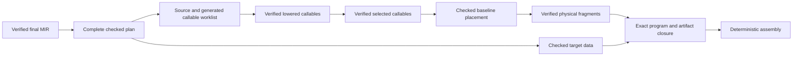

# Complete Low-Level Lowering Migration Design Proposal

Status: accepted, frozen and promoted on 2026-09-19. Accepted after review of
the proposal committed as `a099d228`. Implementation:
[complete lowering migration roadmap](COMPLETE_LOW_LEVEL_LOWERING_MIGRATION_ROADMAP.md),
implemented from baseline `9e6177fe`. Source assessment: `edff66b5`, after completion
of the private native pilot and the independent golden-artifact ownership fix. Parent:
[Low-Level Compiler Architecture](LOW_LEVEL_COMPILER_ARCHITECTURE_DESIGN_PROPOSAL.md).
Inherited contracts: the frozen
[phase architecture](../archive/LOW_LEVEL_PHASE_ARCHITECTURE_DESIGN_PROPOSAL.md),
[LIR model](../archive/LOW_LEVEL_IR_MODEL_DESIGN_PROPOSAL.md), and
[target selection and physical realization](../archive/TARGET_SELECTION_PHYSICAL_REALIZATION_DESIGN_PROPOSAL.md)
designs. The maintained
[migration coverage record](LOW_LEVEL_COMPILER_MIGRATION_COVERAGE.md) is the
exhaustive handoff and remains authoritative for operation, helper, witness,
and transition status.

## Purpose and completion boundary

Migrate every currently supported x86-64 language and runtime behavior from
verified final MIR through the checked low-level pipeline implemented by the
first three architecture workstreams. The result is a complete private native
path using lowered LIR, target selection, independently checked baseline stack
placement, symbolic frames, typed physical realization, and exact artifact
closure.

This workstream completes lowering and native parity. It does not make the new
path the production default. Default selection, public phase observation,
legacy-backend removal, final naming and facade consolidation, full foundation
cost acceptance, and cumulative architectural closure belong to the following
architecture-adoption workstream. Register allocation remains a later,
independent design.

Completion requires:

- every row in the migration coverage record to have checked new-pipeline
  delivery evidence or an explicit, reviewed disposition;
- every physically retained source body and generated helper required by both
  artifact policies to pass through the new pipeline without delegating any
  fragment to legacy selection;
- complete object, ownership, optional, array, string, I/O, dispatch, static
  lifecycle, trace, entry, data, and artifact behavior to execute natively;
- the current x86-64 ABI, runtime ABI, diagnostics, failure order, destruction
  order, trace attribution, sparse retention, and deterministic output to remain
  stable at their owning boundaries;
- both complete-artifact and reachable-artifact policies, default and minimal
  MIR schedules, and enabled and omitted runtime tracing to have explicit parity
  evidence; and
- the private full-language entry to have no feature allowlist or silent
  fallback after planning begins.

The assembly text need not be byte-identical to legacy output. Native results,
observable failures, ABI behavior, retained artifact sets, phase invariants and
configuration-local determinism must be equivalent. Incidental frame offsets,
scratch choices and instruction spelling belong to their new owners.

## Present state and inherited invariants

The private pilot already carries ordinary scalar memory, control flow,
guarded numeric operations, complete primitive conversions, direct and indirect
scalar calls, scalar C boundaries, entry, failure reporting, both trace modes,
baseline placement, frames, physical verification and assembly publication
through every new phase. It also supplies streaming callable receipts, exact
program reconciliation and typed data dependencies. Public/default emission
continues through the legacy x86 backend.

The remaining work is broad semantic expansion rather than another phase-model
experiment. Preserve these inherited invariants:

- final MIR remains the only semantic backend input; lowering receives no AST,
  HIR, resolver, type-checker, pass-internal or mutable certificate state;
- checked planning freezes layouts, signatures, runtime entities, dispatch,
  static, trace, data and generated-family facts before executable lowering;
- lowered LIR contains values, addresses, memory operations, calls, explicit
  CFG, effects and trace actions, but no physical registers, frame offsets or
  x86 instructions;
- selected LIR describes all operands, ties, clobbers, resources, ABI bindings,
  effects and bounded recipe requirements before placement;
- baseline placement is a real strategy whose output crosses the independent
  checker; realization cannot invent storage, semantic branches, calls, helpers
  or undeclared scratch;
- verification and program closure are bound to exact contexts, snapshots and
  parent receipts; builder history or an equal-content replacement confers no
  authority;
- generated bodies use the same callable publication pipeline as source bodies;
  data and callable dependencies are typed and never inferred from rendered
  assembly; and
- sparse bodies remain absent. Neither complete-mode retention nor migration
  admission may recreate a body excluded by the verified final-MIR product.

## Accepted migration architecture

Migration proceeds by complete dependency families. A family extends planning,
shared lowering, target selection, physical realization, data publication and
native evidence together. It must not add an opaque lifecycle or aggregate
instruction merely to defer expansion to the legacy target. Repeated expansions
belong in reusable lowering components or generated callables; the LIR itself
continues to use its small executable vocabulary.

The unit of safety is the retained whole program. During migration, admission
may reject a program whose retained surface contains a family that is not yet
implemented. Once a program is admitted, every source body, helper, data record
and artifact is compiled by the new path. Per-callable fallback would allow
legacy behavior to hide missing dependencies, split verification authority and
make program closure unreliable, so it is prohibited.

Focused fixtures should require the new path directly and grow as families
land. The production backend remains unchanged until adoption; a failure in an
admitted private compilation is reported as a new-pipeline defect and never
retries through legacy lowering.

The sibling Niflheim migration checklist supports staged parity and a final
single backend boundary. Skald does not copy its temporary public backend switch
or reachability bypass: Skald already receives sealed, reachability-qualified
final MIR and keeps migration selection private until the complete checked path
is ready for the separate adoption decision.

## Planning, layout and physical-retention facts

Planning must project the complete finite set of facts used by lowering and
selection. Extend checked plan domains only for facts with downstream consumers:

- exact and complete class layouts, base/field offsets and destruction plans;
- object-view component shapes, dispatch tables, virtual families, interface
  requirements and runtime membership metadata;
- recursive optional, optional-box, array, shared-header and element lifecycle
  layouts;
- static activation/shutdown plans and static storage dispositions;
- string/literal backing, panic, trace, TLS and runtime-service declarations;
- generated helper identities, signatures, dependencies and attribution; and
- complete/reachable artifact roots and typed relocation dependencies.

Lowering may inspect final MIR only through the checked planning/lowering
boundary. Selection and later phases consume the plan and verified LIR; they do
not follow nominal identities back into MIR or source models. Add facts before
their first consumer and remove the corresponding narrow lint allowance in the
same task where practical.

### Complete-mode inactive static storage

Complete-artifact mode currently retains unreachable bodies that can reference
an inactive static. Promoting that field into the semantic active-static domain
would incorrectly add initialization and shutdown effects, while rejecting the
reference would lose complete-mode parity.

Represent this case explicitly in the checked plan. Static storage has either an
active semantic disposition or a retained-inactive physical disposition. An
active static participates in the certified activation and shutdown plans. A
retained-inactive static receives zero-initialized target storage only when a
physically retained body has a typed reference to it; it has no initializer,
cleanup or semantic reachability effect. Reachable-artifact mode cannot contain
such a reference. Lowered and selected verification check the disposition and
typed dependency rather than treating every static artifact as active.

This is a narrow amendment to the earlier rule that rejected all inactive
static references. The implementation roadmap must settle the exact fact and
effect representation before migrating static access. It must retain negative
tests for forged active/inactive substitutions, missing storage, accidental
lifecycle participation and reachable-mode leakage.

## Lowering aggregate and lifecycle behavior

Addressable semantic values remain explicit objects. Shared lowering computes
addresses from checked layouts and emits ordinary scalar values, loads, stores,
calls, checks, trace actions and CFG. It preserves place provenance and object
origin components needed by aliases, checked views, receiver calls and hidden
aggregate results. Zero-size and metadata-only views remain explicit plan/call
facts and do not acquire fictitious storage.

Lifecycle expansion happens before lowered publication:

- initialization targets the final destination and publishes state only after
  all required work succeeds;
- copy construction, assignment and cleanup follow certified base/field order;
- shared replacement retains or secures the replacement before releasing the
  previous owner, and last-owner release preserves the original allocation
  across finalization before freeing it exactly once;
- optional state, guard counts and zero-niche shared owners are explicit memory
  and control flow, including overflow, underflow, absent-access and pinned
  mutation behavior;
- array construction maintains an initialized prefix, publishes only complete
  storage, destroys in reverse order, secures anchors across replacement and
  preserves slice snapshot semantics; and
- cleanup preserves already computed return/call results and exact source
  attribution while executing in verified reverse completion order.

Checked-view end markers with no runtime effect stay verified lifetime markers.
Optional and optional-box view endings that change guard state remain executable
operations. The design must not collapse those cases because their source names
look similar.

The existing LIR operation set is expected to express these expansions. A new
operation is justified only when an executable primitive cannot be represented
without losing independent verification or causing an unbounded expansion. Any
schema addition requires an explicit amendment with effects, checking,
selection, physical and inspection coverage before consumers use it.

## Calls, dispatch and generated callables

All calls use the existing role-based logical component contract. Shared
lowering stabilizes targets and operands in source evaluation order, including
hidden result destinations, receivers, complete-object origins, dynamic
metadata, aliases, places and shared owners. Target selection classifies the
checked signature and materialized components; it cannot rediscover source
types or reorder semantic evaluation.

Direct, static, register-indirect, method, virtual and interface calls all enter
the same selected call boundary. Runtime dispatch loads use checked table and
slot facts. Aggregate results are caller-owned objects passed through the hidden
destination protocol; scalar and shared-owner results remain values. Existing
internal and external x86-64 ABI behavior, including register/stack pressure and
the C scalar boundary, remains unchanged.

Generated callable families are first-class worklist items:

- array element initialization, copying, cloning, destruction, release and
  shared finalization;
- raw-address complete-class copy wrappers;
- shared-handle retain/release helpers;
- complete-class and exact optional-box finalizers;
- program initialization and finalization coordinators; and
- the exported entry wrapper.

Each family has one deterministic identity owner, checked signature and typed
dependencies. Recursive class/array/optional graphs are closed by reservation
and completion receipts, not by recursive Rust calls or duplicated bodies.
Helpers inherit or suppress source attribution according to the existing call
attribution contract; they do not invent source trace frames. Generated bodies
pass ordinary lowered, selected and physical verification.

## Feature-family ordering

The implementation roadmap should order complete families by dependency:

1. Extend plan facts, complex places, target data and dispatch metadata. Resolve
   retained-inactive statics before any static consumer.
2. Migrate aggregate call shapes, object views, direct/virtual/interface
   dispatch, checked casts, initialization and copy/destruction primitives.
3. Migrate shared ownership, retain/release/finalization and shared fields,
   including hard-defect and reported-failure paths.
4. Migrate scalar, aggregate, class, shared and boxed optionals with guarded
   access and recursive cleanup.
5. Migrate arrays and their recursive generated helpers, anchors, indexed
   construction, element lists, slices, aliasing and all element lifecycle
   shapes.
6. Migrate strings, literal backings and standard I/O with anchored buffers and
   exact runtime services.
7. Migrate active/inactive statics, program startup/shutdown and the complete
   entry protocol.
8. Complete trace attribution, typed data/relocation closure, both retention
   policies, observation parity and the exhaustive coverage reconciliation.

Roadmap tasks may split a family further when one review would mix unrelated
invariants. A task must still end with an executable checked slice rather than
leaving a placeholder opcode or unverified bridge for a later task. Cross-family
fixtures can be added early and enabled when all of their dependencies land.

## Trace, data, artifacts and errors

Enabled tracing preserves frame eligibility, initial source locations,
success-only call-site replacement, failure reporting locations, inherited
helper attribution, push/pop order and result preservation. Omitted tracing
performs no source lookup and creates no trace action, metadata, TLS reference or
frame object. Reporting configuration cannot change generated semantics.

Publish literal bytes, runtime failure messages, dispatch metadata, optional and
array descriptors, trace strings, TLS zero storage and static slots as checked
typed data. Data records own their relocations and dependencies. Artifact
closure starts from the requested exported/retained roots and follows verified
callable and data references; rendered symbols are never parsed to reconstruct
the graph.

Preserve exact user-visible failure messages, source spans and operation order.
Reported language/runtime failures call the checked reporter and terminate
without unwind. Invalid headers, impossible guard underflow and violated checked
helper preconditions remain hard defects. Backend construction, selection,
placement, frame, realization and publication failures retain structured target,
callable, phase and origin context. Filtering, inspection and fallback must not
hide an error.

## Ownership and transition structure

The shared projection and lowering implementation has outgrown the word
`pilot`. Early in LA04, move reusable owners from `backend::pilot` into cohesive
planning/lowering modules with stable semantic names. Keep a thin private
full-path test entry while migration is incomplete. The x86 target keeps its
selection, placement, frame, physical and closure owners under the native
target boundary. The final production facade and removal of the private entry
belong to LA05.

Do not duplicate the legacy backend's module tree mechanically. Reuse checked
plans, generic address/call/lifecycle builders and generated-family worklists
where they express one responsibility. Keep target instruction recipes and ABI
classification x86-owned. Extraction from legacy code is acceptable only for a
leaf rule whose inputs no longer include MIR IDs, fixed frame homes or legacy
machine state.

The implementation roadmap must maintain an artifact ledger. It starts with:

| Artifact | Present purpose | Intended disposition |
| --- | --- | --- |
| `backend::pilot` projection, admission and lowering names | Private scalar-pilot construction | Rename reusable owners during LA04; remove feature allowlists when coverage is complete |
| `x86_64_sysv::native::pilot` entry and inspection adapter | Explicit no-fallback whole-program test path | Retain through LA04 parity; replace with the sole production orchestration during LA05 |
| New-pipeline `cfg_attr(not(test), allow(...))` annotations and facade re-exports | Permit staged private consumers | Remove as real consumers land; transfer only adoption-facing residues to LA05 |
| Legacy/new differential helpers and forced-new-path fixtures | Detect migration gaps without changing the default | Retain focused final-interface regressions; retire broad duplication during LA05 cumulative review |
| Legacy x86 lowering, frames, machine model and emitter | Production backend and parity oracle | Unchanged by LA04; remove in LA05 after adoption gates pass |

Every new bridge, alias, gate, allowance, exploratory store or instrumentation
hook must record its introducing task/commit, removal task and final disposition.
Manual commits between tasks do not discharge that obligation.

## Portability boundary

Shared lowering may depend on checked pointer/layout facts and logical component
roles, but not x86 register names, SysV argument positions, concrete frame
offsets, red-zone assumptions or GNU assembly syntax. Target data encodings,
dispatch record layouts, ABI classification, instruction recipes and physical
relocations remain target-owned.

Extend the existing synthetic target only when a shared contract gains a new
kind of resource, ABI role, frame object, transfer or preservation rule. Review
representative aggregate results, metadata receivers, recursive helpers,
retained-inactive data and lifecycle calls against AArch64 constraints. LA04
does not implement an AArch64 backend, and it must not create a universal
cross-target instruction set.

## Validation and acceptance evidence

Tests stay with their owners. For each migrated family require:

- focused planning, lowering and verifier negatives for malformed facts,
  lifetimes, effects, dependencies, contexts and snapshots;
- native selection/placement/frame/physical tests for actual ABI shapes,
  calls, resources, transfers, large offsets and generated control flow;
- assembler acceptance and native execution of ordinary, boundary, failure and
  pressure cases;
- source-level goldens or existing feature-owned native witnesses for exact
  observable behavior; and
- coverage-record updates naming the delivered operation/helper rows and their
  durable witnesses.

The final parity matrix crosses:

| Axis | Required values |
| --- | --- |
| MIR schedule | default, minimal/none where supported |
| Runtime trace | enabled, omitted |
| Artifact policy | complete, reachable only |
| Callable family | source, generated lifecycle/helper, entry/coordinator |
| ABI/value family | scalar, aggregate result, receiver/origin, alias/place, shared owner, indirect target, C runtime |
| Behavior | success, reported failure, hard-defect negative, recursive cleanup, pressure |

Use semantic outputs and exact ABI/lifecycle assertions as primary oracles.
Run independent-process dump/assembly determinism and both debug and optimized
golden execution. The complete repository gate, full golden determinism,
release golden gate, Rust 1.82 MSRV check and relevant robustness/runtime suites
are mandatory at closure.

LA04 records structural and cost observations using the maintained measurement
protocol, including compile time/RSS, phase counts, assembly/text size, frame
metrics and native result digests. These observations detect explosive
regressions and prepare LA05; they do not grant foundation cost acceptance or
resolve the eleven retained inconclusive timing classifications. LA05 performs
compatible paired adoption measurements and owns any reviewed cost exception.

## Checkpoints and failure policy

| Checkpoint | Proceed when | If it fails |
| --- | --- | --- |
| Complete fact model | Complex layouts, dispatch, generated identities, data dependencies and active/retained-inactive statics have checked owners | Amend the owning model before dependent lowering; do not query legacy planners from later phases |
| Aggregate/lifecycle core | Object calls, origins, copies, cleanup and shared last-owner release execute through verified LIR and native pressure cases | Correct effects, call roles or lifecycle expansion before optionals/arrays build on them |
| Recursive family closure | Optional/array/helper recursion publishes exact receipts and typed data without retained drafts or legacy fragments | Fix worklist/inventory authority; do not special-case recursion in emission |
| Full private parity | Every coverage row is delivered and the complete matrix passes with no unsupported retained program | Promote the implementation to LA05 adoption design; otherwise add explicit corrective roadmap tasks |

A failed family implementation does not justify weakening verifier authority,
adding per-callable fallback or making the production default depend on an
incomplete path. Correct the owning contract, split the family, or explicitly
amend this proposal. Independently useful tests and facts remain; rejected
bridges and dormant schema are removed from the correct committed boundary.

## Roadmap shape after acceptance

One implementation roadmap can deliver this design, but it will contain many
PR-sized tasks. Begin with fact/static-disposition readiness, then follow the
feature-family order above. Add explicit checkpoint tasks after the lifecycle
core and recursive aggregate families. End with exhaustive coverage
reconciliation, private parity, measurement capture, and a cumulative diff
review that removes residual migration scaffolding and transfers only
adoption-owned artifacts to LA05.

No further design proposal is required merely to split implementation work.
Create a focused amendment or sub-proposal only if a checkpoint exposes a new
representation, ABI, runtime or phase-authority decision not settled here.

## Alternatives

| Alternative | Reason not proposed |
| --- | --- |
| Migrate one callable at a time with legacy fallback | Splits program authority and lets missing helper/data dependencies pass unnoticed |
| Reuse legacy assembly fragments as LIR operations | Hides values, calls, effects and clobbers from checking and prevents later allocation |
| Add high-level optional/array/lifecycle target opcodes | Moves semantic expansion below target selection and duplicates meaning per architecture |
| Flip the production default during family migration | Couples parity work to rollout and makes regressions difficult to attribute |
| Require byte-identical legacy assembly | Freezes incidental frames and scratch choices that the new architecture intentionally owns differently |
| Fold LA05 into this workstream | Mixes feature completeness with rollout, public observation, legacy deletion and cost acceptance |
| Add register allocation now | Makes correctness of full lowering depend on an optimization that is intentionally a later replaceable placement strategy |

## Accepted decisions

This proposal selects whole-program no-fallback migration, dependency-ordered
families, ordinary LIR expansion for lifecycle/aggregates, explicit
retained-inactive static storage, first-class generated callables, typed data
closure, early removal of shared `pilot` naming, full private parity in LA04 and
production adoption in LA05.

Acceptance confirms three boundaries:

1. retained-inactive static storage is the accepted complete-mode representation
   and does not participate in semantic startup/shutdown;
2. LA04 renames shared projection/lowering owners while retaining only the thin
   native private entry until LA05; and
3. public driver phase observations remain LA05, while LA04 requires complete
   private requested checkpoints and deterministic inspection.

The implementation roadmap owns delivery and may amend this frozen design only
through an explicit recorded decision before dependent work proceeds.
