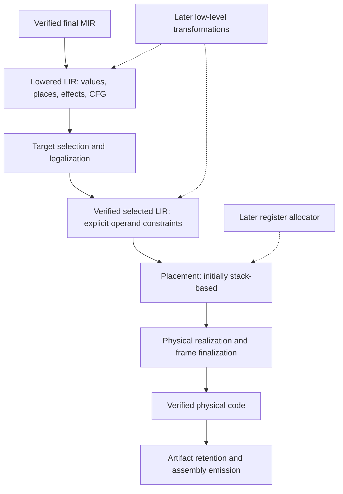

# Low-Level Compiler Architecture Design Proposal

Status: accepted architectural direction, prepared 2026-09-17. The first child
[phase architecture design](../archive/LOW_LEVEL_PHASE_ARCHITECTURE_DESIGN_PROPOSAL.md)
is accepted and frozen, and its
[preparation roadmap](../archive/LOW_LEVEL_PHASE_ARCHITECTURE_ROADMAP.md) is complete.
The [handoff](LOW_LEVEL_COMPILER_MIGRATION_COVERAGE.md#preparation-handoff-and-next-designs)
now informs the accepted, frozen and promoted
[LIR model, construction and verification design](LOW_LEVEL_IR_MODEL_DESIGN_PROPOSAL.md).
Its [implementation roadmap](LOW_LEVEL_IR_MODEL_ROADMAP.md) is in progress;
LI01–LI03 delivered checked declarations/identities and the complete lowered
execution vocabulary, including calls, effects and tracing. LI04 added independent
graph/value-flow verification; LI05 added full lowered callable verification and
genuine immutable publication/receipts. LI06 added finalized lowered inventories
and parent-bound target declarations. LI07 delivered selected draft/resource/ABI
contracts; LI08 added independent shared/target verification, immutable selected
publication and complete selected inventories. LI09 delivered consuming edits, explicit remaps and snapshot-bound analyses;
immutable inspection and deterministic phase dumps are next.
Common model contracts are frozen; concrete target counterparts remain
LA03 decisions before dependent native implementation. Later child designs
and roadmaps remain pending.
Repository assessment baseline:
`f97a9e51`. Program implementation baseline: `495debd3`, before the migration
contract/coverage work began. Child roadmaps retain their own task baselines.

This proposal defines a new low-level compiler architecture between verified
final MIR and native assembly. Its purpose is to establish explicit phases,
a low-level intermediate representation (LIR), and maintainable backend
boundaries that support further optimization and additional architectures.
Proper register allocation motivates these contracts and is the final planned
consumer, with its own design proposal and implementation roadmap.

This is the architectural direction behind
[A22](CODEBASE_CLEANUP_AUDIT.md#a22--introduce-virtual-register-target-ir-when-justified).
It coordinates multiple focused designs rather than prescribing one large
implementation roadmap. Acceptance selects the direction and phase contracts
below; child designs settle exact representations, APIs, and implementation
sequences before dependent work begins.

## Purpose and completion boundaries

The current native backend combines instruction selection, physical register
choices, memory placement, and assembly construction. Separate these concerns
so that each phase has a clear input, output, owner, and independently testable
contract.

The architectural foundation is complete when:

- Every currently supported x86-64 program passes through one maintained LIR
  pipeline, including generated helpers, entry wrappers, and static lifecycle.
- Computation, control flow, memory, calls, and observable effects are explicit
  before physical placement. LIR values do not inherently denote stack homes.
- Target selection, placement, frame finalization, and emission have explicit
  boundaries. A simple stack-based placement strategy executes the complete
  language through those boundaries.
- LIR and physical-code verification, deterministic dumps, phase observations,
  and focused tests make the new pipeline inspectable and maintainable.
- Shared machinery is independent of x86 instruction and ABI details, with
  its contracts reviewed against a future AArch64 target.
- Native semantics, diagnostics, ABI interoperability, trace behavior, and
  deterministic output are preserved, and compiler/runtime costs are measured.
- The old direct lowering path and migration-only adapters are removed.

These criteria do not require a production register allocator or demonstrated
register-allocation speedups. The architecture must be independently useful
and production-capable before that optimization is introduced.

The final planned workstream implements register allocation against the
established placement boundary. It has separate correctness, performance, and
adoption criteria. Until that workstream is complete or explicitly deferred,
the overarching program records it as pending even if the foundation is
complete. A rejected allocator must not automatically undo an accepted
architecture.

Scalar-storage promotion, semantic MIR SSA, instruction scheduling, general
alias analysis, vectorization, inlining, and full AArch64 delivery are separate
follow-ups. Their requirements inform the architecture, but their implementation
does not gate foundation completion. Standard-library cleanup and source-language
changes are outside this program.

## Current architecture and motivation

The existing [backend facade](../../crates/skald-compiler/src/backend/mod.rs)
already consumes a sealed `VerifiedFinalMirProgram` with narrow reachability
and optional source queries. Preserve this semantic boundary. The backend
must not gain dependencies on AST, HIR, type checking, or mutable verification
certificates.

The [backend contract](../compiler/BACKEND.md#input-and-legality-boundary)
currently places frame planning before instruction selection:

| Current owner | Coupled responsibilities | Proposed separation |
| --- | --- | --- |
| [Frame planning](../../crates/skald-compiler/src/backend/x86_64_sysv/frame.rs) | Storage layout, object-origin homes, and a fixed home for every transient value | Symbolic memory requirements followed by placement-dependent frame finalization |
| [Callable lowering](../../crates/skald-compiler/src/backend/x86_64_sysv/lower.rs) | Prologue, parameter spills, labels, semantic expansion, and physical instructions | MIR-to-LIR lowering, target selection, and physical realization |
| [Value movement](../../crates/skald-compiler/src/backend/x86_64_sysv/lower/value.rs) | Scalar representation and loads/stores through scratch registers and frame homes | Value representation, explicit memory operations, and placement |
| [Machine model](../../crates/skald-compiler/src/backend/x86_64_sysv/machine.rs) | Typed physical assembly with implicit instruction constraints | Selected virtual operands and constraints, followed by physical instructions |
| [Call lowering](../../crates/skald-compiler/src/backend/x86_64_sysv/lower/call.rs) | ABI classification, argument movement, calls, and result storage | Call contracts and constrained operands before physical movement |

The [architecture discovery](OPTIMIZATION_ARCHITECTURE_DISCOVERIES.md#5-direct-physical-register-backend-lowering)
and [optimization catalog](OPTIMIZATION_CANDIDATE_CATALOG.md#target-private-low-level-value-and-control-flow-graph)
identify the missing low-level transformation boundary. Register allocation is
one consequence: values are assigned homes before a placement algorithm can
choose otherwise. Target instruction combining, branch layout, and other
transformations also lack a suitable explicit phase today.

The new architecture should provide that phase without making the successful
delivery of any one optimization its acceptance test. No new speedup has been
measured for this proposal.

## Proposed phases and products

The diagram describes logical boundaries. It does not require a full program
copy at each arrow or a separate crate for each stage. Prefer callable-local
processing and consuming transitions where practical. Each child design must
specify owned products, borrowed queries, mutation authority, verification,
and analysis invalidation.

| Boundary | Responsibility and required result |
| --- | --- |
| Verified final MIR to lowered LIR | Translate semantic operations into explicit executable values, memory operations, calls, and control flow; retain source attribution and symbol dependencies |
| Lowered LIR to selected LIR | Select target forms, classify ABI operands, and expose all register, memory, flag, scratch, and control-flow constraints needed by placement |
| Selected LIR to placement result | Assign legal operand locations and describe required moves; preserve logical dataflow independently of placement strategy |
| Placement to physical code | Resolve moves, finalize stack offsets and save areas, expand bounded target operations, and produce legal physical instructions |
| Physical code to assembly | Verify final invariants, retain required artifacts, render deterministic target assembly, and report structured target errors |

Lowered and selected LIR can be stages of one structural representation. The
first child design must decide which invariants require separate types or
seals and which can use verified stage transitions. A phase name alone is not
an enforced boundary. Do not allow emission to consume unselected virtual code
or physical realization to silently discover undeclared calls and clobbers.

## LIR scope and ownership

LIR is backend-owned executable structure below final MIR. Share its graph,
identities, common operand/effect vocabulary, and structural utilities. Each
target owns its selected instruction vocabulary, legalization, ABI rules, and
physical emission. Do not force x86-64 and AArch64 into a shared instruction
set or reproduce the semantic MIR operation set wholesale in a new IR.

The LIR design must identify any common lowering operations that deserve a
shared representation before target selection. Such operations need a clear
consumer and elimination boundary. A separate broad target-neutral optimizer
IR is not required by this proposal.

| Responsibility | Owner |
| --- | --- |
| Language meaning, evaluation and destruction order, semantic correctness | Existing frontend, MIR, and final-MIR pipeline |
| Portable semantic optimizations | Existing final-MIR passes and future semantic optimization designs |
| LIR block/value/stack-object identities, structural graph, effect vocabulary, verification and dumps | Shared private backend LIR support |
| Target layout, selected instructions, ABI classification, register resources and constraints | Target implementation |
| Placement contract and dataflow checking | Shared backend support, parameterized by target requirements |
| Initial stack placement and later allocation | Separate implementations of the placement contract; retention of both requires a continuing purpose |
| Frame finalization, physical legalization, relocations and assembly rendering | Target implementation |
| Runtime-visible layouts, ownership and reporting behavior | Existing focused compiler/runtime contracts |

Initially keep these responsibilities in cohesive private modules within
`skald-compiler`, using its existing facade-oriented organization. A new crate
or public plugin interface needs an independent consumer. Share algorithms
where contracts fit, but do not reuse MIR IDs or cached CFG facts after target
lowering has introduced different blocks and instructions.

### Values, memory, and control flow

Distinguish logical scalar values, address values, symbolic memory objects,
and physical locations. IDs belong to a low-level callable, including generated
helpers. Preserve semantic identities and source origins as metadata where
needed; they are not physical-placement identities.

LIR must represent complete executable CFGs, including branches introduced by
casts, checked arithmetic correction, optional guards, lifecycle loops, and
failure handling. Logical value widths and canonical forms remain explicit.
Removing or changing a store must not remove `u8` or `bool` canonicalization
that the old backend performed alongside that store.

Addressable aggregates and aliases retain explicit memory operations. A pointer
can become a register value without moving the pointed-to object out of memory.
MIR storage roles and lifetime markers remain semantic facts; neither a role
named `ScalarSpill` nor a `StorageDead` marker substitutes for machine liveness
or a proof that memory can be eliminated.

The accepted [phase architecture design](../archive/LOW_LEVEL_PHASE_ARCHITECTURE_DESIGN_PROPOSAL.md)
selects single-definition machine values with dominance and block parameters.
Account for joins, loops, edge copies, and two-address constraints explicitly
in the detailed LIR design. This does not convert semantic MIR to SSA:
cross-block values support lowering-created control flow while general
scalar-storage promotion remains outside the foundation.

### Effects, calls, and legal expansion

Calls expose arguments, results, indirect targets, hidden receiver/result/origin
components, and ABI constraints before placement. Define clobbers for ordinary,
runtime, and generated-helper calls. Preserve source evaluation order when
marshalling arguments. Keep x86-64 internal and external ABIs stable during
migration.

Describe memory effects, allocation, ownership operations, termination, flag
dependencies, and trace publication conservatively. Exact panic attribution,
destructor timing, and hard-trap behavior remain observable contracts. Initial
lowering can preserve instruction order; effects must still be explicit enough
that placement-generated moves or later transformations cannot invalidate it.
Allocation does not require completing A23's general alias/effect analysis.

Expand operations that introduce calls, hidden clobbers, or CFG before the
selected-LIR boundary. A late physical expansion is allowed only with a bounded,
verified contract describing all required scratch resources and effects.
Compare/branch flag sequences can use verified bundles until a more general
flag representation is justified. Spill/move insertion and large frame-offset
legalization must obey those same constraints.

### Placement and physical realization

The first complete backend uses simple deterministic stack-based placement.
It assigns homes to virtual values and uses target-declared scratch resources
to realize instructions. This implementation must consume selected LIR through
the same location/move contract intended for a later allocator. It must not
call the old MIR-to-physical selector or encode mandatory homes into LIR.

Plan symbolic objects early for addressable locals, aggregates, trace records,
and ABI requirements. Finalize offsets after placement establishes value homes
and any spills or preserved-register saves. Keep incoming arguments, outgoing
call areas, local objects, trace records, and placement-created homes distinct.
Preserve the frame pointer and conservative object lifetimes initially.

Design the placement result to support locations per operand/program point,
including transfers between locations. A permanent value-to-register map would
prevent later splitting and spilling. Specify parallel-copy semantics and
target legalization of transfers without implementing an optimizing allocator
as part of the foundation.

## Extensibility requirements

### Additional target architectures

A target is an architecture plus platform/ABI profile. Use Linux AArch64 with
AAPCS64 and ELF as the first design reference alongside current x86-64 SysV.
Actual target registration, toolchain/runtime support, and complete native
AArch64 testing belong to a separate delivery proposal.

Before freezing shared contracts, provide worked examples for both targets
covering integer/floating banks, overlapping register views, reserved resources,
fixed and tied operands, calls, frame access, and symbol/TLS addressing.
AArch64's link register and platform register roles must not be expressed as
x86 conventions. Preservation rules can depend on width: AAPCS64 preserves the
low 64 bits of `v8`–`v15`. See the official
[AAPCS64 specification](https://github.com/ARM-software/abi-aa/blob/main/aapcs64/aapcs64.rst).

Use a small synthetic target to test common contracts with different resource
sets and constraints. This demonstrates structural portability, not a completed
AArch64 port. Implement a bounded cross-target prototype only when unresolved
questions require it, with a recorded retention or removal decision.

### Register allocation and other transformations

Allocation requirements inform the architecture early: explicit uses/defs,
register banks and overlap, fixed/tied operands, operand timing, call clobbers,
symbolic stack objects, and complete CFGs. Review representative allocation
scenarios against the contracts before freezing them. Algorithm selection,
production liveness, interval splitting, spill heuristics, and allocator
performance testing belong to the final allocation workstream.

Do not let one allocator library silently dictate the compiler architecture.
If a candidate imposes SSA or edge restrictions, identify that compatibility
requirement during contract review. The final allocation proposal compares
an in-house allocator and suitable libraries, including verification,
maintenance, licensing, MSRV, determinism, limits, and code quality. No allocator
or dependency is selected here.

The same boundaries provide homes for instruction combining, constant
materialization, branch layout, copy elimination, post-placement peepholes,
and later scheduling. Each transformation needs its own legality, verification,
and profitability argument. Do not build an unused generic pass framework or
make those optimizations prerequisites for LIR migration.

Scalar-storage promotion has a separate role: allocation of transient values
alone will not keep ordinary MIR loop variables in registers. A later focused
design can promote a proven set of non-addressed scalar locals and carriers,
preserving initialization and lifetime epochs. General memory, alias, and
ownership state remain explicit. Future semantic SSA can feed the same value
and edge contracts without reconstructing source-shaped storage.

## Focused design program

The identifiers name design workstreams, not PRs. Each needs a focused proposal
and then a roadmap with testable handoffs. Split large workstreams further when
they mix independently reviewable responsibilities. Child proposals record
inherited invariants, detailed decisions, scope, tests, and transition artifacts.

| Workstream | Focused design | Required handoff | Dependencies |
| --- | --- | --- | --- |
| LA01 | **[Phase architecture and backend ownership](../archive/LOW_LEVEL_PHASE_ARCHITECTURE_DESIGN_PROPOSAL.md):** phase products, LIR scope, shared/target split, invariants, observation and error boundaries | Accepted contracts, representative x86/AArch64 walkthroughs, coverage inventory, and foundation validation/measurement policy | This overarching direction accepted |
| LA02 | **[LIR model, construction, and verification](LOW_LEVEL_IR_MODEL_DESIGN_PROPOSAL.md):** identities, values, memory, CFG/edges, effects, call representation, mutation rules, and dumps | Accepted/frozen design; [roadmap in progress](LOW_LEVEL_IR_MODEL_ROADMAP.md), LI01–LI09 complete, LI10 next. Complete lowered execution vocabulary and full callable verification/publication and complete-program closure delivered; selected draft/resource contracts and shared/target verification/publication delivered. Required handoff: supported construction/transformation APIs and exact selected-stage requirements | LA01 and common declaration readiness complete; selected publication readiness passed; concrete native counterparts remain LA03 |
| LA03 | **Target selection and physical realization:** x86 instruction/ABI selection, stack-based placement, symbolic frames, transfer resolution, legalization, and emission | End-to-end executable scalar/control-flow/call pilot through every new phase, without a production register allocator | LA01–LA02; jointly settle selection/placement/frame contracts before implementation |
| LA04 | **Complete lowering migration:** all remaining operations, ownership, objects, optionals, arrays, helpers, static lifecycle, traces, entry, and artifact retention | Complete supported x86 behavior through LIR and stack placement; explicit operation/helper coverage and native parity | LA03; may split into lifecycle/helper and observation/artifact proposals |
| LA05 | **Architecture consolidation and adoption:** production default, phase observations, living contracts, fallback removal, and cumulative review | Independently complete foundation; old direct lowering retired; one maintained LIR pipeline with verified baseline placement | LA04; portability review and full foundation validation |
| LA06 | **Register allocation:** allocator selection, liveness, constraints, preserved registers, splitting/spilling, coalescing scope, checking, and measured adoption | Proper allocation implemented through the existing placement contract; separate acceptance evidence and explicit disposition of baseline placement | LA05; own design and implementation roadmap |

LA01 preparation is complete; its [archived roadmap](../archive/LOW_LEVEL_PHASE_ARCHITECTURE_ROADMAP.md)
records contract, regression and baseline qualification. The maintained
[coverage/handoff inventory](LOW_LEVEL_COMPILER_MIGRATION_COVERAGE.md#preparation-handoff-and-next-designs)
carries pending delivery and joint LA02/LA03 questions.
The foundation is LA01–LA05; LA06 is the final
planned consumer. Early contract exercises can reason about allocation without
building its algorithm. If a contract problem appears later, amend the owning
design explicitly rather than adding hidden exceptions across phases.

The full AArch64 backend, scalar promotion, and semantic SSA can each proceed
under their own proposals after their specific prerequisites are ready. They
do not block LA05, and scalar promotion is not an implicit part of LA06.

## Integration checkpoints

| Checkpoint | Evidence | Proceed | If requirements are not met |
| --- | --- | --- | --- |
| Phase and representation readiness | Clear products/owners, x86/AArch64 mappings, effect and placement contracts, tests and coverage plan | Freeze the relevant child contracts and implement the LIR/pilot | Revise contracts; remove rejected experimental adapters and retain useful findings |
| Executable architectural pilot | Scalar operations, CFG, calls, traces, symbolic frames, verification and emission work with baseline stack placement | Migrate the remaining language surface | Fix the phase boundary or realization; do not require an allocator to repair an incomplete pipeline |
| Foundation adoption and closure | Full parity, maintained observations, cost evidence, no legacy fallback, cumulative review and repository gates pass | Mark the foundation complete and proceed to the allocation proposal | Add explicit corrective tasks; do not claim completion based only on a scalar pilot |
| Allocation adoption | Independent allocation checking, forced spills, ABI/trace parity, deterministic output, and agreed performance evidence | Adopt allocation and close its roadmap with baseline-placement disposition | Fix or reject the allocator approach; keep the accepted LIR architecture and working baseline placement |

Foundation acceptance is architectural completeness and semantic equivalence,
with measured compiler/runtime cost and explicit limits for material regressions.
It does not require fewer frame accesses or faster generated code. LA01 defines
its measurement protocol before the pilot; unexplained major regressions still
need correction or an explicit tradeoff decision before adoption.

LA06 defines separate structural and performance criteria before evaluating an
allocator. Do not retroactively apply its speedup thresholds to the foundation
or weaken correctness requirements to obtain a speedup. Repeat noisy runs;
record any accepted revision to criteria explicitly.

## Validation and evidence

Follow the existing [test ownership](../development/TESTING.md) and
[cleanup measurement procedure](../development/CLEANUP_MEASUREMENTS.md).
Extend maintained fixtures and harnesses rather than creating a second
compiler/process runner.

| Foundation layer | Required evidence |
| --- | --- |
| Phase contracts | Invalid stage transitions rejected; semantic seals remain intact; no reverse dependencies; analyses invalidated after relevant mutation |
| LIR | Malformed CFG, value/edge agreement, memory references, effects and selected-operand constraints; stable deterministic dumps |
| Target realization | Fixed/tied/overlapping operands, call clobbers, indirect targets, transfer cycles, stack alignment, frame offsets, and scratch requirements |
| Complete behavior | Both MIR profiles; checked arithmetic and floating edges; calls/dispatch; arrays/optionals/shared ownership; destruction order; static startup/shutdown; enabled and omitted runtime traces |
| Artifacts and tooling | Assembler/linker acceptance, C runtime ABI probes, retained symbols/data, structured errors, phase reporting, and independent-process determinism |
| Repository | Focused task tests, `make check`, applicable `make msrv-check`, and relevant long-running gates named by each roadmap |

Verification of declared LIR dataflow cannot establish that instruction
selection declared every real clobber or effect. Native adversarial and target
contract tests must independently cover that boundary. The final-MIR verifier
remains authoritative for semantic correctness.

Capture compiler time/RSS, phase costs, frame sizes, assembly sizes, and native
result digests before migration and at adoption, with consistent source,
toolchain, runtime, target, MIR profile, and trace policy. Native timings need
repeated comparisons on the same controlled host. Assembly may change across
implementations while remaining deterministic within one configuration.

Preserve semantic goldens and exact ABI assertions. Replace incidental tests
of old scratch choices or frame offsets with assertions at the new owning
phase. An old/new differential test is useful during migration but is not the
only correctness oracle.

Allocation later adds independent value-flow checking, corrupted-allocation
tests, forced pressure/spills, and quality measurements. Scalar promotion
later adds eligibility, alias/address rejection, and repeated-lifetime tests.
Keep their evidence distinct from the foundation's completion record.

## Migration, cleanup, and documentation

Migrate at complete callable boundaries with explicit pilot eligibility and
coverage accounting. A test mode must require the new path so fallback cannot
silently hide a missing implementation. Old and new callables retain a common
ABI while migration is active. No new LIR callable may delegate opaque fragments
back to the old selector.

Baseline stack placement is the foundation's real placement implementation,
not the old backend in a wrapper. LA05 removes the old selector and migration
fallback while retaining baseline placement. LA06 then either replaces baseline
placement or justifies keeping it for a specific supported mode or testing
purpose through the same pipeline. Do not retain duplicate selection, ABI,
frame, or emission logic merely to support two placement strategies.

Record program and child implementation baselines. Maintain a cross-roadmap
transition ledger with file/symbol, introducing task/commit, purpose, removal
owner, and final disposition. Child closure reviews cumulative changes and
explicitly transfers any still-needed bridge to its next owner. LA05 reviews
the whole foundation diff; LA06 reviews its own changes and the final integrated
architecture. Include staged, unstaged, and untracked work: manual local commits
between tasks never discharge cleanup obligations.

When an experiment is rejected, selectively remove or restore its implementation
from the correct committed boundary while retaining accepted contracts, useful
tests, and evidence. Preserve unrelated work and local history. If allocation
is deferred, record the foundation as complete and allocation as deferred;
do not describe A22's register-allocation outcome as delivered.

Child roadmaps update living backend/phase contracts, debugging and dumps,
reporting, ABI/trace descriptions, and profile behavior as implementation lands.
An empty semantic optimization schedule need not imply the old backend or a
permanent stack-only mode; define placement policy explicitly at adoption.
Keep the active index, audit, catalog, and overarching status consistent.

This proposal owns the architectural direction. Child designs own detailed
contracts; roadmaps own execution and acceptance evidence; the optimization
catalog owns later candidates. Record actionable discoveries separately and
avoid adding unrelated optimization work to an active migration.

## Decisions selected and left open

Acceptance selects explicit low-level phases, verified LIR, shared structural
infrastructure with target-owned instruction/ABI realization, complete migration
using baseline stack placement, and architecture consolidation before production
register allocation. It preserves the native backend and the existing final-MIR
semantic boundary.

LA01 settles phase authority, shared lowering ownership, and the machine value
contract. Exact Rust schemas, executable seals, operation inventories, and
target interfaces remain with LA02/LA03.
An allocator algorithm or library is chosen by LA06. Full semantic SSA,
scalar promotion, and a complete second target retain their own scope and
delivery decisions. Phase preparation has qualified existing-boundary witnesses
and complete baseline inputs; noisy cost gates remain inconclusive. The immediate
next step is LI10 of the
[LA02 model roadmap](LOW_LEVEL_IR_MODEL_ROADMAP.md), implementing the
[frozen model design](LOW_LEVEL_IR_MODEL_DESIGN_PROPOSAL.md) using the
[handoff](LOW_LEVEL_COMPILER_MIGRATION_COVERAGE.md#preparation-handoff-and-next-designs)
and its readiness checkpoints. The LA03 design can proceed against these common
contracts; its concrete target interfaces must be settled before dependent native
implementation.
